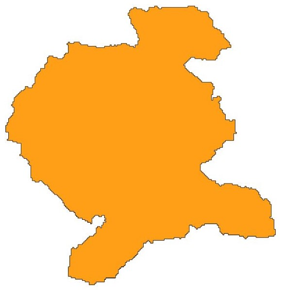

=========================
Digital Elevation Model
=========================

A brief overview of the features for working with Digital Elevation Models (DEM).

Class Instance
----------------
Let's start by instantiating the classes.

.. code-block:: python

    import SuomiGeoData
    paituli = SuomiGeoData.Paituli()
    syke = SuomiGeoData.Syke()
    
    
Download by Labels
--------------------
Download DEM using label names.

.. code-block:: python
    
    # download DEM using labels
    paituli.dem_download_by_labels(
        labels=['K3244G', 'X4344A'], 
        folder_path=r"C:\Users\Username\Folder"
    )
    
    
Example area
--------------
Access the example area and plot it.

.. code-block:: python

    # save the example area
    example_gdf = paituli.get_example_area
    example_file = r"C:\Users\Username\Folder\example.shp"
    example_gdf.to_file(example_file)
    # plot the example area
    example_area.iloc[0].geometry
    

Clipped DEM
-------------
Get the clipped DEM for the example area.

.. code-block:: python
    
    paituli.dem_clipped_download_by_area(
        shape_file=example_file,
        raster_file=r"C:\Users\Username\Folder\example_area.tif"
    )

    
Clipped DEM from Syke's Subcatchment Identifiers
--------------------------------------------------
Download the vector files of catchment divisions and obtain DEM data from the subcatchment identifiers.

.. code-block:: python
    
    # download catchment divisions
    syke.download_catchment_divisions_2023(
        folder_path=r"C:\Users\Username\Folder"
    )
    
    # clipped DEM from the subcatchment identifier
    paituli.dem_clipped_download_by_syke_subcatchment(
        shape_file=r"C:\Users\Username\Folder\catchment_division_level_5.shp",
        level=5,
        id_subcatchments=[15730214505, 15730214514],
        raster_file=r"C:\Users\Username\Folder\syke_subcatchment_clipped_dem.tif"
    )
